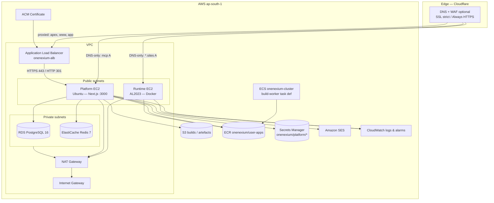

# OneNexium — AWS infrastructure reference (LLD)

**Purpose:** Single reference for **everything deployed in AWS** for OneNexium while you build product code.  
**Source of truth for IDs:** `onenexium-infra-vars.env` — `source` it (bash) or mirror into PowerShell `$env:VAR`.  
**Domain / DNS (Cloudflare):** See `CLOUDFLARE_SETUP_APPLIED.md` (not duplicated here in full).  
**Do not commit:** `.pem` files, `anand_singh_accessKeys.csv`, or API tokens.

---

## 1. Account and region

| Item | Value |
|------|--------|
| **AWS account ID** | `268054298224` |
| **Primary region** | `ap-south-1` (Mumbai) |
| **Primary domain** | `onenexium.com` (DNS at Cloudflare) |

---

## 2. Architecture (logical)



**Traffic summary**

| Path | Route |
|------|--------|
| Public web app | Browser → Cloudflare → **ALB :443** → Platform EC2 **:3000** |
| HTTP to ALB | **:80** → **301** → **https://same host** **:443** |
| MCP hostname | `mcp.onenexium.com` → **Platform EIP :22 / future :443** (bypasses ALB today) |
| Tenant sites | `*.sites.onenexium.com` → **Runtime EIP** (Traefik optional; not fully wired in all envs) |

---

## 3. Network (VPC)

| Resource | ID / name |
|----------|-----------|
| **VPC** | `vpc-010645b24f8d5dff1` |
| **Internet Gateway** | `igw-0a023c167b7d0badf` |
| **NAT Gateway** | `nat-0758e93099f0c6874` |
| **Public route table** | `rtb-029ff230e89425f57` |
| **Public subnet 1** | `subnet-05bca156573ed7768` |
| **Public subnet 2** | `subnet-057524e9e06b71810` |
| **Private subnet 1** | `subnet-0f72256a7136165ee` |
| **Private subnet 2** | `subnet-05e3a6058a45871e6` |

Private subnets host **RDS** and **Redis**; outbound internet via **NAT**. Platform and Runtime sit in **public** subnets with **EIPs** for direct SSH and for DNS that points at EIPs.

---

## 4. Security groups

| Name (typical) | ID | Role |
|----------------|-----|------|
| **onenexium-alb-sg** | `sg-058055779e195f4de` | ALB ingress 80/443 from internet |
| **onenexium-platform-sg** | `sg-0657b9fadfa3549a7` | Platform: 22, 80, 443, **3000 from ALB SG**, 8000 from ALB SG (MCP path), etc. |
| **onenexium-runtime-sg** | `sg-05eff501f86793297` | Runtime: SSH, HTTP/S for Traefik when enabled |
| **RDS SG** | `sg-0c2a3deb15aeb363d` | Postgres from Platform (and admin paths as designed) |
| **Redis SG** | `sg-09db3802a83db7171` | Redis from Platform |
| **Fargate / ECS worker SG** | `sg-042e56318eba3a3e1` | Build worker / Fargate tasks |

If SSH “times out” from home, check **Platform SG** inbound **TCP 22** (your public IP may need updating if rules are locked down).

---

## 5. Compute — EC2

### 5.1 Platform (application server)

| Field | Value |
|------|--------|
| **Name tag** | `onenexium-platform` |
| **Instance ID** | `i-081b6335b35bfb292` |
| **OS** | Ubuntu 22.04 (typical) |
| **Type** | `t2.large` (resize in console/CLI if needed) |
| **AZ** | `ap-south-1b` |
| **Private IP** | `10.0.16.135` |
| **Elastic IP** | `13.206.23.228` |
| **SSH user** | `ubuntu` |
| **SSH key (local file)** | `Onenexium_aws_setup/onenexium-plat-ssh-20260322.pem` (not in git) |
| **App** | Next.js under `/home/ubuntu/onenexium_platform`, **PM2** process `onenexium-platform`, port **3000** |
| **IAM** | Instance profile `onenexium-platform-profile` (S3, Secrets Manager, SES, etc. per policy) |

### 5.2 Runtime (Docker / tenant workloads)

| Field | Value |
|------|--------|
| **Name tag** | `onenexium-runtime` |
| **Instance ID** | `i-054b26f20ec8c7658` |
| **OS** | Amazon Linux 2023 |
| **Type** | `t3.xlarge` |
| **AZ** | `ap-south-1a` |
| **Private IP** | `10.0.4.8` |
| **Elastic IP** | `65.2.94.110` |
| **SSH user** | `ec2-user` |
| **SSH key (local file)** | `Onenexium_aws_setup/onenexium-run-ssh-20260322.pem` |
| **Docker** | Installed; bridge network **`onenexium-runtime`** |

---

## 6. Load balancer (ALB)

| Field | Value |
|------|--------|
| **Name** | `onenexium-alb` |
| **DNS** | `onenexium-alb-1014963325.ap-south-1.elb.amazonaws.com` |
| **ARN** | `arn:aws:elasticloadbalancing:ap-south-1:268054298224:loadbalancer/app/onenexium-alb/0d5d53cbc0d163c3` |
| **HTTP :80** | Default action: **redirect** to HTTPS (301), preserve host/path/query |
| **HTTPS :443** | Default action: **forward** to **platform** target group |
| **HTTPS listener ARN** | `arn:aws:elasticloadbalancing:ap-south-1:268054298224:listener/app/onenexium-alb/0d5d53cbc0d163c3/814eba60cf666e1e` |
| **ACM certificate ARN** | `arn:aws:acm:ap-south-1:268054298224:certificate/1017fa60-9284-4370-8b4b-eec51c48c2ff` |

### Target groups

| Name | ARN suffix | Port / protocol | Health check | Notes |
|------|------------|-----------------|--------------|--------|
| **onenexium-platform-tg** | `.../onenexium-platform-tg/c214d4051da77a39` | **3000** HTTP | `GET /api/health` | Primary app |
| **onenexium-runtime-tg** | `.../onenexium-runtime-tg/41176ce80ff36e7d` | **443** HTTPS | `/` | Used when ALB routes `*.sites` here; may show **unused** if DNS bypasses ALB |

---

## 7. Data stores

| Service | Identifier | Endpoint (summary) |
|---------|------------|---------------------|
| **RDS PostgreSQL 16** | `onenexium-platform-db` | `onenexium-platform-db.cbwgy4waesof.ap-south-1.rds.amazonaws.com:5432` |
| **ElastiCache Redis 7** | `onenexium-redis` | `onenexium-redis.k6mecf.0001.aps1.cache.amazonaws.com:6379` |
| **S3** | `onenexium-storage-268054298224` | Versioning + encryption (see bucket policy / lifecycle JSON in repo) |

Connection strings belong in **Secrets Manager** (`DATABASE_URL`, `REDIS_URL`), not in this file.

---

## 8. Container registry and ECS

| Resource | Value |
|----------|--------|
| **ECR registry** | `268054298224.dkr.ecr.ap-south-1.amazonaws.com` |
| **User apps repository** | `onenexium/user-apps` |
| **Full URI** | `268054298224.dkr.ecr.ap-south-1.amazonaws.com/onenexium/user-apps` |
| **ECS cluster** | `onenexium-cluster` |
| **Build worker** | Task definition `onenexium-build-worker` (replace placeholder image when pipeline is ready) |

Login from EC2 or laptop:

```bash
aws ecr get-login-password --region ap-south-1 | docker login --username AWS --password-stdin 268054298224.dkr.ecr.ap-south-1.amazonaws.com
```

---

## 9. Secrets Manager

Prefix: **`onenexium/platform/`**

Typical secret names (non-exhaustive — verify in console):

- `DATABASE_URL`, `REDIS_URL`
- `NEXTAUTH_SECRET`, `MCP_AUTH_TOKEN`
- `GOOGLE_CLIENT_ID`, `GOOGLE_CLIENT_SECRET`
- `ANTHROPIC_API_KEY`
- `AWS_REGION`, `ECR_REGISTRY`, `S3_BUCKET`, `RUNTIME_EC2_IP`
- `SES_FROM_EMAIL`, `SES_CONFIGURATION_SET`

**IAM:** Platform instance role must allow `secretsmanager:GetSecretValue` on these ARNs (see `iam/` JSON).

---

## 10. Amazon SES

| Item | Value |
|------|--------|
| **Region** | `ap-south-1` |
| **Configuration set** | `onenexium-transactional` |
| **Domain identity** | `onenexium.com` |
| **DNS** | DKIM CNAMEs + `_amazonses` TXT in Cloudflare — `SES_CLI_VERIFICATION_REPORT.md` |

Re-check sending readiness:

```bash
aws sesv2 get-email-identity --email-identity onenexium.com --region ap-south-1
```

**Sandbox:** Until production access is approved, sending is limited to verified addresses.

---

## 11. Observability

- **CloudWatch** log groups and **alarms** for Platform CPU, RDS, Redis (see `SETUP_SUMMARY.md`).
- Optional: attach **SNS** topics to alarms for email/Slack.

---

## 12. IAM (high level)

- **Platform EC2:** role + instance profile for S3, Secrets Manager, SES, ECR read, etc. (`iam/platform-policy.json` or equivalent).
- **Runtime EC2:** role for ECR pull and runtime operations.
- **ECS / build worker:** task execution role + task role as defined at cluster creation.
- **Human access:** IAM user (e.g. `anand_singh`) for CLI/console — **do not commit** access keys; use SSO or rotate keys stored outside git.

---

## 13. Quick verification CLI

```bash
export AWS_REGION=ap-south-1
# Load IDs
source onenexium-infra-vars.env   # bash

aws ec2 describe-instance-status --instance-ids "$PLATFORM_INSTANCE_ID" "$RUNTIME_INSTANCE_ID" --include-all-instances
aws elbv2 describe-target-health --target-group-arn "$PLATFORM_TG_ARN"
aws acm describe-certificate --certificate-arn "$CERT_ARN" --query Certificate.Status
curl -sS https://onenexium.com/api/health
```

---

## 14. Related documentation (this repo)

| File | Topic |
|------|--------|
| `docs/README.md` | Index of documentation in `docs/` |
| `docs/AWS_CREDENTIALS.md` | Credentials and Secrets Manager naming |
| `onenexium-infra-vars.env` | All exportable ARNs and endpoints |
| `SETUP_SUMMARY.md` | Historical “what was built” |
| `USER_GUIDE.md` | Day-2 operations, ports, troubleshooting |
| `CLOUDFLARE_SETUP_APPLIED.md` | DNS + edge TLS + ALB TLS notes |
| `PLATFORM_EC2_DEPLOYED.md` | Platform PM2 deploy / redeploy |
| `final_setup/FINAL_SETUP.md` | Roll-up status + gaps |
| `Platform_deployement.md` | Long end-to-end deploy guide |
| `SES_SETUP.md` / `SES_CLI_VERIFICATION_REPORT.md` | Email |
| `INFRASTRUCTURE_REMAINING.md` | Optional follow-ups |

---

## 15. Maintenance notes

1. **Drift:** If someone changes resources in the console, refresh this doc and `onenexium-infra-vars.env` using `aws ec2 describe-*`, `aws elbv2 describe-*`, etc.
2. **Certificates:** ACM renewal is automatic while DNS validation records remain valid.
3. **EIPs:** Reassociation changes public IPs — update Cloudflare A records and this doc if EIPs change.
4. **SSH:** `IdentityFile` in `~/.ssh/config` must use **`Users`** (plural) and the full path to the **`.pem`** on Windows.

---

*Document version: 2026-03-28 — aligned with `onenexium-infra-vars.env` and current OneNexium deployment practices.*
